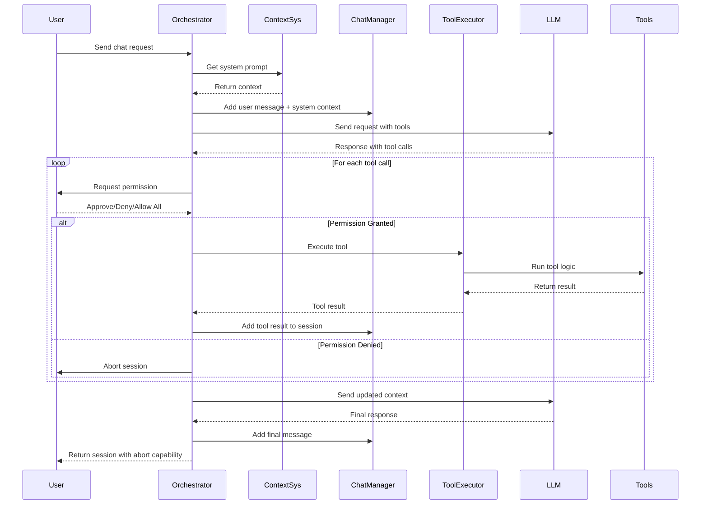

# 🛠️ LLM Toolkit

A TypeScript toolkit for integrating Large Language Models with tool execution capabilities.

## 🎯 Purpose & Features

A toolkit for integrating LLM applications with tool execution capabilities. Provides functionality for handling tool calls, managing chat sessions, and executing operations.

- **🎯 Clean API**: Simple interface with minimal setup required
- **📐 Type Safety**: Full TypeScript support with type definitions
- **📱 Session Management**: Session handling with abort controls and permission inheritance
- **🧠 Context**: System prompts with environment-aware ContextSys integration
- **🔧 Tool Execution**: Tool registration with error handling and validation
- **🔒 Permission System**: Approval controls for tool execution with `approve`, `deny`, and `allow_all` options
- **🛡️ Security**: Security measures with tool usage restrictions and validation
- **🌊 Streaming Support**: API for both streaming and standard responses
- **⚡ Event-Driven**: Real-time callbacks for thinking, messages, tool calls, and results

> [!NOTE]
> This toolkit provides LLM-tool integration with permission controls. The [`Orchestrator`](src/integrator/Orchestrator.ts) handles chat interactions, tool execution, and user permissions, while [`ContextSys`](src/integrator/ContextSys.ts) provides environment context for AI responses.

## 🏗️ Architecture



### 🧩 Components:
- **Core**: Tool execution logic and validation
- **Integrator**: Chat orchestration, session management, and permission handling
- **Interfaces**: TypeScript type definitions for all components
- **Schemas**: Tool schema definitions for LLM integration
- **Utils**: Utility functions for ID generation and common operations

---

## 🧪 How to Test

### 🔧 Prerequisites

1. **👤 Create Ollama Account**
   - Sign up at [ollama.com](https://ollama.com)
   - Create an API key by visiting [ollama.com/settings/keys](https://ollama.com/settings/keys)

2. **📦 Clone Repository**
   ```bash
   git clone https://github.com/NeaByteLab/LLM-Toolkit.git
   cd LLM-Toolkit
   ```

3. **⚙️ Environment Setup**
   ```bash
   # Create environment file
   echo "OLLAMA_KEY=your_api_key_here" > .env

   # Edit .env and replace with your actual API key
   # OLLAMA_KEY=your_actual_api_key_here
   ```

4. **📦 Install Dependencies**
   ```bash
   npm install
   ```

### 🚀 Running Tests

#### **🎯 Main Example**
```bash
npx tsx ./src/index.ts
```

This demonstrates the complete toolkit with:
- Permission system (denies TerminalCmd, approves FileCreate/FileEdit)
- Streaming responses
- Auto-abort after 3 seconds
- All event callbacks

---

## 🔧 Adding Custom Tools

### 📁 File Structure
```
src/
├── schemas/                  # Tool schema definitions
├── core/
│   ├── base/                 # Tool implementation logic
│   └── ToolExecutor.ts       # Tool registration & execution
```

### 📋 Steps

1. **Create Schema** (`/src/schemas/YourTool.ts`)
   ```typescript
   export default {
     type: 'function',
     function: {
       name: 'your_tool_name',
       description: 'What your tool does',
       parameters: {
         type: 'object',
         properties: {
           param1: { type: 'string', description: 'Description' }
         },
         required: ['param1']
       }
     }
   }
   ```

2. **Implement Logic** (`/src/core/base/YourTool.ts`)
   ```typescript
   export default class YourTool {
     private readonly param1: string

     constructor(args: SchemaYourTool) {
       const { param1 } = args
       this.param1 = param1
     }

     async execute(): Promise<string> {
       const resValidate = this.validate()
       if (resValidate !== 'ok') {
         return resValidate
       }
       // Your logic here
       return 'Success message'
     }

     private validate(): string {
       if (typeof this.param1 !== 'string') {
         return '`param1` must be a string.'
       }
       return 'ok'
     }
   }
   ```

3. **Register in [ToolExecutor.ts](src/core/ToolExecutor.ts)**
   ```typescript
   // Add import
   import YourTool from '@core/base/YourTool'
   import type { SchemaYourTool } from '@root/interfaces/index'

   // Add to switch statement
   case 'your_tool_name':
     return new YourTool(args as SchemaYourTool).execute()
   ```

---

## 🎨 Customizing Prompts & Context

### 🤖 System Prompt ([`/src/integrator/ContextSys.ts`](src/integrator/ContextSys.ts))
To edit the AI's behavior and personality:
- 🔧 Modify `getSystemPrompt()` method
- ➕➖ Add/remove capabilities, guidelines, or instructions
- 🎭 Customize the AI agent's behavior and personality
- 🔒 Update security guidelines or tool usage rules

### 🌍 Context Information ([`/src/integrator/ContextEnv.ts`](src/integrator/ContextEnv.ts))
To edit the environment context:
- 🔧 Modify `getContext()` to change format or add/remove information
- ➕ Add new methods to gather additional system information
- ⏰ Customize time format in `getTimeInfo()`
- 💻 Add more OS details in `getOSInfo()`
- 📁 Include additional path information in `getPathInfo()`

---

## 🔒 Permission System

The toolkit includes a permission system for controlling tool execution:

### **Permission Actions**
- **`approve`**: Allow this specific tool call
- **`deny`**: Block this tool call and abort session
- **`allow_all`**: Approve this call and all future calls in this session

### **Example Usage**
```typescript
const session = await orchestrator.chat(message, {
  onAskPermission: (data) => {
    console.log(`Permission requested for: ${data.toolName}`)

    // Custom permission logic
    if (data.toolName === 'TerminalCmd') {
      return { action: 'deny' } // Block terminal commands
    }

    return { action: 'approve' } // Allow everything else
  },
  // ... other options
})
```

---

## 🛑 Session Management

### **Session Control**
```typescript
// Abort specific session
session.abort()

// Check if session is active
const isActive = session.isActive()

// Abort all sessions
orchestrator.abort()
```

### **Session Lifecycle**
1. **Auto-creation**: Sessions are created when you call `chat()`
2. **Context injection**: System prompt is added on first message
3. **Permission tracking**: Session remembers "allow all" settings
4. **Termination**: Abort stops all operations

---

## 🔧 Additional Modules

### **🧠 Embedding Module**
- **[Embedding README](src/core/embedding/README.md)**: Text vectorization and similarity search using transformer models
- Provides semantic search, text similarity, and content clustering capabilities
- Independent module for advanced text processing features

---

## 📄 License

This project is licensed under the MIT license. See the [LICENSE](LICENSE) file for more info.