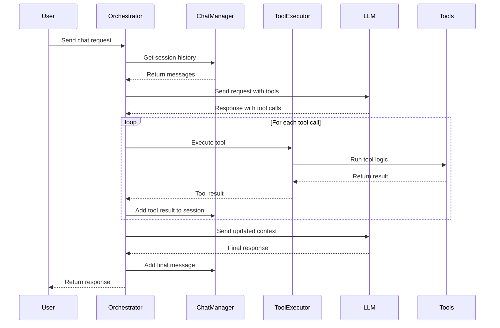

# 🛠️ LLM Toolkit

A TypeScript toolkit for integrating Large Language Models with tool execution capabilities.

## 🎯 Purpose & Features

A simple toolkit for integrating LLM applications with tool execution capabilities. Provides basic functionality for handling tool calls, managing chat sessions, and executing operations.

- **Tool Schemas**: Basic schemas for common operations
- **Validation System**: Simple parameter validation and error handling
- **Tool Execution**: Basic framework for executing tools with error handling
- **Session Management**: Simple chat session management with message history
- **Real-time Events**: Basic event-driven architecture for live updates
- **Type Safety**: TypeScript support with type definitions
- **Multi-Provider**: Basic support for multiple LLM providers

> [!NOTE]
> This toolkit shows how to handle multiple tool calls, manage sessions, and structure tool execution. The code is straightforward - you can see how the `Orchestrator` loops through tool calls, how `ChatManager` keeps track of messages, and how `ToolExecutor` runs the actual tools.

## 🏗️ Architecture



### 🧩 Components:
- **Core**: Tool execution logic and validation
- **Integrator**: Chat orchestration and session management
- **Interfaces**: TypeScript type definitions for tool calling
- **Schemas**: Tool schema definitions for LLM integration
- **Utils**: Utility functions for ID generation and common operations

---

## 🧪 How to Test

### 🔧 Prerequisites

1. **👤 Create Ollama Account**
   - Sign up at [ollama.com](https://ollama.com)
   - Create an API key by visiting [ollama.com/settings/keys](https://ollama.com/settings/keys)

2. **⚙️ Environment Setup**
   ```bash
   # Create environment file
   echo "OLLAMA_KEY=your_api_key_here" > .env

   # Edit .env and replace with your actual API key
   # OLLAMA_KEY=your_actual_api_key_here
   ```

3. **📦 Install Dependencies**
   ```bash
   npm install
   ```

### 🚀 Running Tests

#### **🌊 Streaming Test**
```bash
npx tsx src/TestStream.ts
```

#### **📄 Non-Streaming Test**
```bash
npx tsx src/TestNonStream.ts
```

---

## 🔧 Adding Custom Tools

### 📁 File Structure
```
src/
├── schemas/                  # Tool schema definitions
├── core/
│   ├── base/                 # Tool implementation logic
│   └── ToolExecutor.ts       # Tool registration & execution
```

### 📋 Steps

1. **Create Schema** (`/src/schemas/YourTool.ts`)
   ```typescript
   export default {
      type: 'function',
      function: {
         name: 'your_tool_name',
         description: 'What your tool does',
         parameters: {
            type: 'object',
            properties: {
            param1: { type: 'string', description: 'Description' }
            },
            required: ['param1']
         }
      }
   }
   ```

2. **Implement Logic** (`/src/core/base/YourTool.ts`)
   ```typescript
   export default class YourTool {
   private readonly param1: string

   constructor(args: SchemaYourTool) {
      const { param1 } = args
      this.param1 = param1
   }

   async execute(): Promise<string> {
      const resValidate = this.validate()
      if (resValidate !== 'ok') {
         return resValidate
      }
      // Your logic here
      return 'Success message'
   }

   private validate(): string {
      if (typeof this.param1 !== 'string') {
         return '`param1` must be a string.'
      }
      return 'ok'
   }
   }
   ```

3. **Register in ToolExecutor.ts**
   ```typescript
   // Add import
   import YourTool from '@core/base/YourTool'
   import type { SchemaYourTool } from '@root/interfaces/index'

   // Add to switch statement
   case 'your_tool_name':
   return new YourTool(args as SchemaYourTool).execute()
   ```

---

## 🎨 Customizing Prompts & Context

### 🤖 System Prompt (`/src/integrator/ContextSys.ts`)
To edit the AI's behavior and personality:
- 🔧 Modify `getSystemPrompt()` method
- ➕➖ Add/remove capabilities, guidelines, or instructions
- 🎭 Customize the AI agent's behavior and personality
- 🔒 Update security guidelines or tool usage rules

### 🌍 Context Information (`/src/integrator/ContextEnv.ts`)
To edit the environment context:
- 🔧 Modify `getContext()` to change format or add/remove information
- ➕ Add new methods to gather additional system information
- ⏰ Customize time format in `getTimeInfo()`
- 💻 Add more OS details in `getOSInfo()`
- 📁 Include additional path information in `getPathInfo()`

---

## ⚠️ Known Issues & Roadmap

### Current Behavior
- **Orchestrator Abort Issues**: The `Orchestrator.abort()` method delegates to `client.abort()` but doesn't handle cleanup of active tool executions or pending operations. When abort is called during tool execution, the orchestrator may not properly terminate running processes, leading to potential resource leaks or incomplete operations.

### Planned Improvements
- **Security Enhancement**: Add approval mechanism for tool execution to prevent unauthorized operations
- **Orchestrator Refactor**: Improve abort handling and process management for better reliability
- **Tool Execution Control**: Implement user confirmation system for sensitive operations

---

## 📄 License

This project is licensed under the MIT license. See the [LICENSE](LICENSE) file for more info.