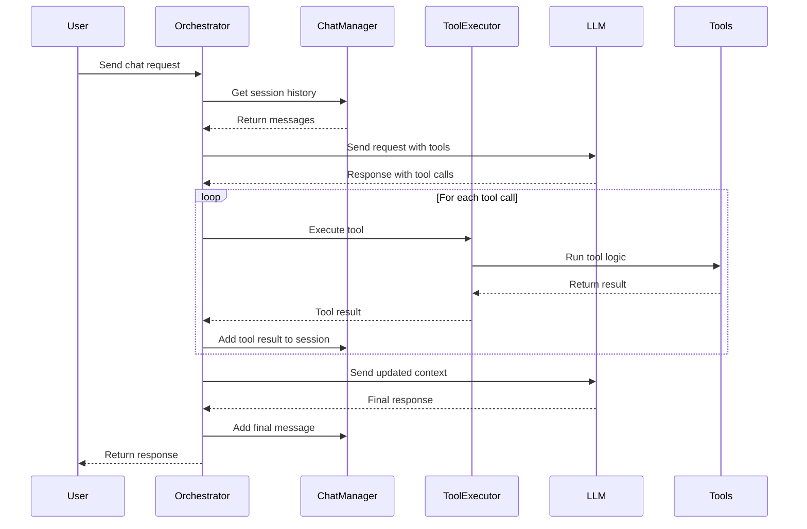

# 🛠️ LLM Toolkit

A TypeScript toolkit for integrating Large Language Models with tool execution capabilities.

## ✨ Features

- **Tool Schemas**: Schemas for various operations
- **Validation System**: Parameter validation and error handling
- **Tool Execution**: Framework for executing tools with error handling
- **Session Management**: Chat session management with message history
- **Real-time Events**: Event-driven architecture for live updates
- **Type Safety**: TypeScript support with type definitions
- **Multi-Provider**: Works with multiple LLM providers

## 🎯 Purpose

This toolkit implements tool calling capabilities in LLM applications. It includes:

- **Type Safety**: TypeScript support with type definitions
- **Tool Schemas**: Definitions for tool calling functionality
- **Validation Logic**: Parameter validation and execution validation
- **Execution Framework**: Tool execution and management
- **Modular Architecture**: Integration with LLM providers

> [!NOTE]
> This is a simple toolkit for building LLM applications with tool calling. It shows how to handle multiple tool calls, manage sessions, and structure tool execution. The code is straightforward - you can see how the Orchestrator loops through tool calls, how ChatManager keeps track of messages, and how ToolExecutor runs the actual tools. Planning to add more common tools like file operations, web scraping, and API calls. Feel free to copy the patterns or use it as a starting point for your own projects.

## 🏗️ Architecture

### **🧩 Components:**
- **Core**: Tool execution logic and validation framework
- **Integrator**: Chat orchestration and session management
- **Interfaces**: TypeScript type definitions for tool calling
- **Schemas**: Tool schema definitions for LLM integration
- **Utils**: Utility functions for ID generation and common operations

---

## 📄 License

This project is licensed under the MIT license. See the [LICENSE](LICENSE) file for more info.